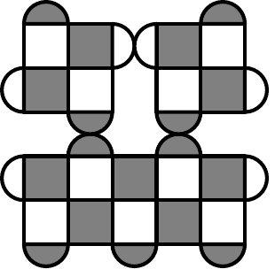

# sc_pic
Little script which produces a TikZ drawing of a rotated surface code. 

You make a file like this (which I've called `xxx_meas.scpic`):
    
    origin_x 0 0 6
    origin_y 0 6 6
    distance_x 6 3 3
    distance_y 3 3 3
    nudges 0 1 0
    bottom_left_colour white black!50!white white
    other_colour black!50!white white black!50!white

Running `python sc_pic.py xxx_meas.scpic` produces a file called `xxx_meas.tikz`, which you can put in a standalone document like this:

    \documentclass{standalone}
    \usepackage{tikz}
    \begin{document}
    \input{xxx_meas.tikz}
    \end{document}

The PDF you get from LaTeXing this document should look like this:

